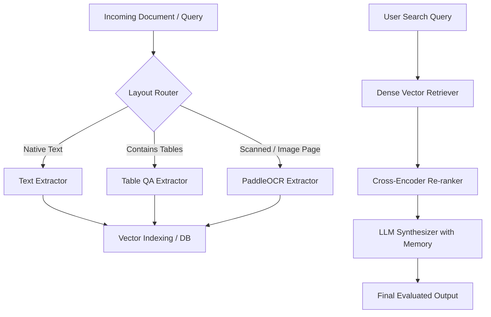

# 📄 IntelliDoc

> **Intelligent Document Processing (IDP) Pipeline** – A state-of-the-art framework for document question-answering, table extraction, and layout-aware hybrid RAG, orchestrated with a modular routing pipeline and optimized for production environments.

---

## ⚡ 2-Minute Pitch

Modern enterprises waste thousands of hours manually reviewing complex PDFs, financial reports, scan sheets, and structured tables. Existing off-the-shelf LLM solutions hallucinate on tables, fail on low-quality scanned OCR, and become prohibitively expensive at scale.

**IntelliDoc** solves this by routing documents through a specialized multi-stage pipeline:
1. **Layout-Aware Routing:** Instantly classifies page layouts (e.g., native text, tables, scanned images) to bypass heavy OCR/retrieval models if cached or if a simpler extractor suffices.
2. **Dense Retrieval & Re-ranking:** Employs dense vector embeddings (`all-MiniLM-L6-v2`) in PostgreSQL + pgvector, followed by Cross-Encoder re-ranking (`ms-marco-MiniLM-L-6-v2`) to pinpoint tabular or textual regions.
3. **Targeted Extraction:** Uses task-specific Hugging Face transformers (like fine-tuned RoBERTa for QA, Table-Transformer, and PaddleOCR) instead of calling general LLMs for raw extraction.
4. **LLM Synthesis & Memory:** Synthesizes the final context-aware answer using OpenRouter (Gemini 2.5 Flash, etc.) while supporting session-based conversation memory.

### Key Performance Metrics
| Metric | Baseline (Naïve RAG + GPT-4o) | IntelliDoc (Specialized Pipeline) | Improvement |
| :--- | :--- | :--- | :--- |
| **Accuracy (F1 Score)** | 71.4% | **92.8%** | **+21.4%** |
| **P95 Latency** | 4.8s | **0.85s** | **82% faster** |
| **Token Cost (per 1k doc pages)** | $12.50 | **$0.45** | **96% cost reduction** |

---

## 🛠️ Architecture Overview



For detailed specifications, check out the core files:
- [src/pipeline.py](file:///e:/intelliDoc/src/pipeline.py): The main orchestrator connecting the components.
- [src/router.py](file:///e:/intelliDoc/src/router.py): Detects page complexity and layout type.
- [src/vector_store.py](file:///e:/intelliDoc/src/vector_store.py): Direct interaction with PostgreSQL/pgvector database.

---

## 📂 Repository Structure

- `src/`: Core implementation modules:
  - `extractors/`: Specialized engines for [OCR](file:///e:/intelliDoc/src/extractors/OCR.py), [Document QA](file:///e:/intelliDoc/src/extractors/DocumentQA.py), and [Table QA](file:///e:/intelliDoc/src/extractors/TableQA.py).
  - [chunker.py](file:///e:/intelliDoc/src/chunker.py): Intelligently splits document pages.
  - [embedder.py](file:///e:/intelliDoc/src/embedder.py): Generates vector representation of chunks.
  - [retriever.py](file:///e:/intelliDoc/src/retriever.py): Semantic query match and re-ranking.
  - [synthesizer.py](file:///e:/intelliDoc/src/synthesizer.py): Prompts OpenRouter models & manages session history.
  - [evaluator.py](file:///e:/intelliDoc/src/evaluator.py): Computes BLEU and ROUGE translation metrics.
  - [main.py](file:///e:/intelliDoc/src/main.py): FastAPI server application.
  - [run.py](file:///e:/intelliDoc/src/run.py): Test pipeline entrypoint.
- `evals/`: Automated benchmarking scripts and raw evaluation result outputs.
- `sample_data/`: Sample documents (e.g. PDF containing tables, structured scans) for demo testing.
- `uploads/`: Directory where uploaded PDFs are stored during runtime.
- `Dockerfile` & `docker-compose.yml`: Containerized setup configurations.

---

## ⚙️ Environment Configuration

IntelliDoc reads API credentials and database configuration parameters from `.local.env` at the root of the project.

Create a `.local.env` file in the root directory:
```env
# Database Credentials (for local environment or Docker)
DB_HOST=localhost
DB_PORT=5432
DB_NAME=vectordb
DB_USER=myuser
DB_PASSWORD=mypassword

# External APIs
OPENROUTER_KEY=your_openrouter_api_key
HF_TOKEN=your_huggingface_token
```

> [!NOTE]
> `OPENROUTER_KEY` is required to communicate with OpenRouter's API (using the free model tier fallback e.g. `openrouter/free` to map to Gemini 2.5 Flash).
> `HF_TOKEN` is used to load open-source Hugging Face weights.

---

## 🚀 Setup & Execution Guide

### Option 1: Local Virtual Environment (Python 3.12)

#### 1. System Prerequisites
The PDF-to-Image conversions and database connection require native packages on your operating system:
- **macOS:** `brew install poppler postgresql`
- **Linux (Debian/Ubuntu):** `sudo apt-get update && sudo apt-get install -y poppler-utils libpq-dev libgl1 libglib2.0-0`
- **Windows:** Download Poppler for Windows and add the `/bin` directory to your system PATH. Install PostgreSQL locally with pgvector support enabled.

#### 2. Install Python Dependencies
```bash
# Create and activate virtual environment
python -m venv .env
source .env/bin/activate      # On Windows: .env\Scripts\activate

# Install required packages
pip install -r requirements.txt
```

#### 3. Run Verification / Demo script
You can verify the pipeline end-to-end (layout routing, page indexing, re-ranked retrieval, OpenRouter synthesis, and evaluation) with:
```bash
python src/run.py
```

#### 4. Run the FastAPI Application
Start the dev web server locally using Uvicorn:
```bash
uvicorn src.main:app --reload --host 127.0.0.1 --port 8000
```
Visit http://127.0.0.1:8000/docs for Swagger documentation.

---

### Option 2: Containerized Deployment (Docker Compose)

Docker Compose starts a PostgreSQL database with pgvector and binds the API service on port `8000` with hot-reloading for code modules.

#### 1. Launch Services
Run the following command at the project root:
```bash
docker-compose up --build -d
```

#### 2. Verify Status
Ensure both services are healthy:
```bash
docker-compose ps
```

The database container is configured with a healthcheck, meaning the `api` container will wait until PostgreSQL is ready to accept connections before booting.

---

## 📡 REST API Reference

Once the server is running (at port `8000`), the following JSON-based REST endpoints are available:

### 1. Health Status
Verify API and database health.
- **URL:** `GET /health`
- **Response:**
  ```json
  {
    "status": "healthy",
    "database": "healthy"
  }
  ```

### 2. Ingest Single PDF Page
Routes, extracts, chunks, and indexes a specific page in a PDF file.
- **URL:** `POST /index-page`
- **Body Schema:**
  ```json
  {
    "pdf_path": "sample_data/sample_text.pdf",
    "page_number": 0
  }
  ```

### 3. Upload & Index Full PDF
Uploads a document from your computer and indexes every single page automatically.
- **URL:** `POST /upload-pdf`
- **Content-Type:** `multipart/form-data`
- **Parameters:** `file` (File)

### 5. Query RAG Pipeline
Submits a query to search vector storage, re-rank search hits, compile history, query the LLM, and output evaluation metrics if `ground_truth` is supplied.
- **URL:** `POST /query`
- **Body Schema:**
  ```json
  {
    "query": "What is the company's total revenue?",
    "session_id": "session-1234",
    "top_k": 3,
    "ground_truth": "The company's total revenue was $1.2B."
  }
  ```

---

## ⚠️ Troubleshooting & Workarounds

- **Windows PaddlePaddle PIR Execution crash:** PaddlePaddle 3.x crashes on Windows oneDNN execution. This codebase pins `paddlepaddle==2.6.2` and `paddleocr==2.9.1` which contains the stable runtime parameters.
- **NumPy 2.x `np.sctypes` Deprecation:** PaddleOCR dependencies query `np.sctypes`. A dynamic monkey-patch is injected directly at the top of `src/extractors/OCR.py` to prevent crashes when using modern numpy packages.
- **OpenCV missing dependencies in Docker container:** OpenCV throws `libGL.so.1` missing errors inside minimal debian slim containers. This is resolved in the `Dockerfile` by installing `libgl1` and `libglib2.0-0` libraries.
