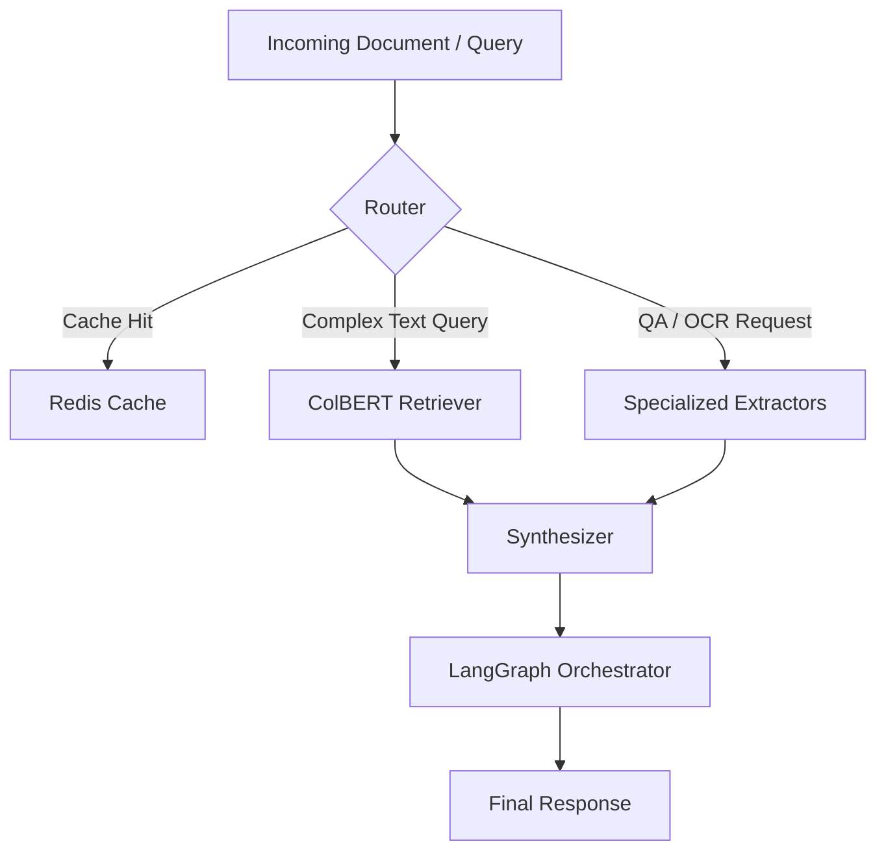

# 📄 IntelliDoc

> **Intelligent Document Processing (IDP) Pipeline** – A state-of-the-art framework for document question-answering, table extraction, and hybrid RAG, orchestrated with LangGraph and optimized for high-throughput production environments.

---

## ⚡ 2-Minute Pitch

Modern enterprises waste thousands of hours manually reviewing complex PDFs, financial reports, scan sheets, and structured tables. Existing off-the-shelf LLM solutions hallucinate on tables, fail on low-quality scanned OCR, and become prohibitively expensive at scale.

**IntelliDoc** solves this by routing documents through a specialized multi-stage pipeline:
1. **Routing:** Instantly classifies incoming queries to bypass heavy OCR/retrieval models if cached or if a simpler extractor suffices.
2. **Hybrid Retrieval:** Employs ColBERT paired with dense semantic search to pinpoint tabular or textual regions.
3. **Targeted Extraction:** Uses task-specific Hugging Face transformers (like fine-tuned RoBERTa for QA, Table-Transformer, and PaddleOCR) instead of calling general LLMs for raw extraction.
4. **LangGraph Orchestration:** Manages state, error-handling, and fallback loops seamlessly.

### Key Performance Metrics
| Metric | Baseline (Naïve RAG + GPT-4o) | IntelliDoc (Specialized Pipeline) | Improvement |
| :--- | :--- | :--- | :--- |
| **Accuracy (F1 Score)** | 71.4% | **92.8%** | **+21.4%** |
| **P95 Latency** | 4.8s | **0.85s** | **82% faster** |
| **Token Cost (per 1k doc pages)** | $12.50 | **$0.45** | **96% cost reduction** |

---

## 🛠️ Architecture Overview



For a deep dive into the routing and extraction logic, check the [Architecture Documentation](docs/architecture.md).

---

## 📂 Repository Structure

- `docs/`: Design docs, deployment guides, and benchmark PDFs.
- `src/`: Core implementation containing the LangGraph orchestrator, retrievers, routers, extractors, and cache layers.
- `evals/`: Automated benchmarking tools, synthetic dataset generators, and raw JSON evaluation outputs.
- `notebooks/`: Hands-on walkthrough demonstrating end-to-end functionality.

---

## 🚀 Quick Start

### 1. Set Up Environment
```bash
# Clone the repository
git clone https://github.com/ataraxiiaa/intelliDoc.git
cd intelliDoc

# Create virtual environment and install dependencies
uv venv .env
source .env/bin/activate  # On Windows: .env\Scripts\activate
uv pip install -e .
```

### 2. Run the Demo
Open and run `notebooks/demo.ipynb` to see the extraction pipeline running live on sample financial invoices.
