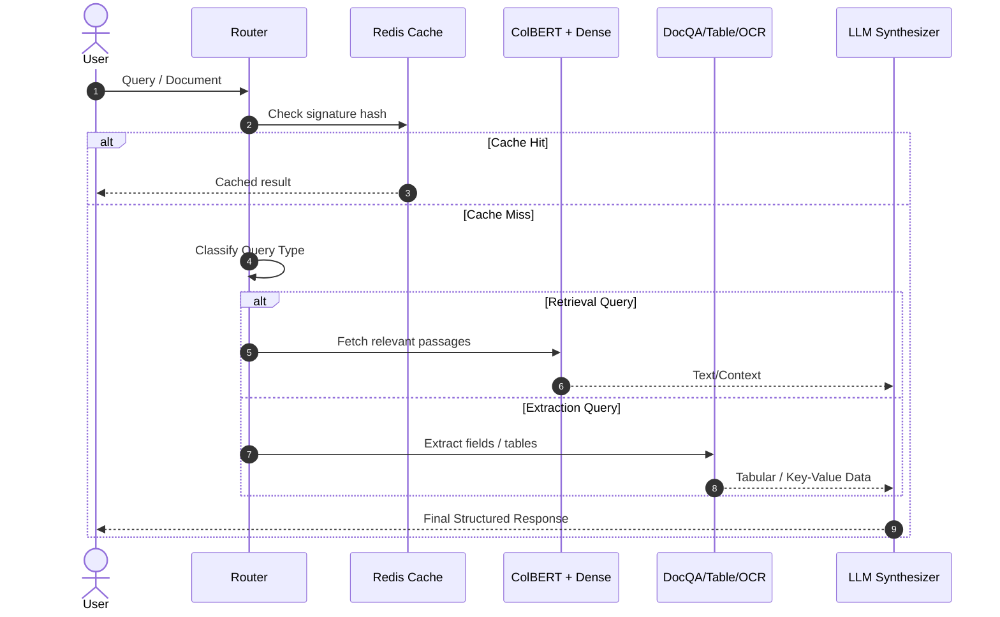

# Architecture Design Specification

This document details the internal design and processing stages of the **IntelliDoc** Intelligent Document Processing framework.

## Pipeline Architecture

IntelliDoc implements a stateful agentic pipeline using **LangGraph** to coordinate routing, extraction, retrieval, and synthesis.

---

## Component Breakdown

### 1. Classification-based Router (`src/router.py`)
Routes queries dynamically using a lightweight text classification model or semantic embeddings. It sorts inputs into three buckets:
- **Direct QA / OCR**: Sent directly to layout-aware extraction models.
- **Semantic / Aggregation queries**: Passed to the retrieval engine.
- **Cache checks**: Checked against the SHA256 signature of the document content + query string in Redis.

### 2. Specialized Extractors (`src/extractors.py`)
Rather than relying on expensive LLMs for OCR and structural table recovery, we deploy lightweight local models:
- **Text-based QA**: Fine-tuned RoBERTa-based pipeline (`deepset/roberta-base-squad2`).
- **Table QA / Extraction**: Structured table parser which reconstructs cell geometries and labels.
- **OCR**: OCR interface for scanned PDF pages.

### 3. ColBERT Retriever (`src/retriever.py`)
Uses late-interaction representation via ColBERT. Unlike single-vector representations, ColBERT keeps token-level representations, enabling accurate search over highly domain-specific terms (such as product SKU numbers or complex financial line-items).

### 4. Synthesizer (`src/synthesizer.py`)
A fast inference step that takes the output of the extractors/retrievers and translates it into the user's requested schema.

### 5. Redis Cache (`src/cache.py`)
A persistence layer that caches intermediate extraction states and final answers to ensure sub-millisecond response times for repeating document flows.
